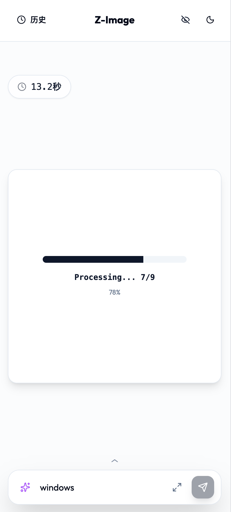

# Z-Image UI

A modern, responsive web interface for ComfyUI image generation workflows, featuring DeepSeek prompt enhancement and a shared gallery.

## Features

*   **Modern UI**: Beautiful, responsive design built with React and TailwindCSS.
*   **Mobile Friendly**: Optimized experience for mobile devices with specific layouts.
*   **Prompt Enhancement**: Integrated DeepSeek API to reason and enhance your prompts for better image results.
*   **History & Gallery**: Local history of your generations and a shared gallery to showcase prompts.
*   **Real-time Progress**: WebSocket integration for real-time generation progress and status updates.
*   **NSFW Mode**: Built-in blurring for sensitive content.

## Screenshots

````carousel

<!-- slide -->

<!-- slide -->

<!-- slide -->

````

## Setup & Run

### Prerequisites
*   Python 3.10+
*   Node.js 18+ (for building frontend)
*   ComfyUI running instance

### Installation

1.  Clone the repository
    ```bash
    git clone https://github.com/FFatTiger/zimage-ui.git
    cd zimage-ui
    ```

2.  Install Backend Dependencies
    ```bash
    # Create virtual environment (optional but recommended)
    python -m venv venv
    source venv/bin/activate  # Windows: venv\Scripts\activate

    # Install requirements
    pip install -r requirements.txt
    ```

3.  Configure Environment
    Copy usage of `.env`:
    ```bash
    # Create a .env file
    echo "COMFY_URL=http://127.0.0.1:8188" >> .env
    echo "WS_URL=ws://127.0.0.1:8188" >> .env
    echo "DEEPSEEK_API_KEY=your_api_key_here" >> .env
    ```

### Running

**macOS / Linux:**
```bash
chmod +x start.sh
./start.sh
```

**Windows:**
```cmd
start.bat
```

**Manual Start:**
1.  Build Frontend:
    ```bash
    cd frontend
    npm install
    npm run build
    cd ..
    ```
2.  Start Backend:
    ```bash
    uvicorn main:app --host 0.0.0.0 --port 8080
    ```

Access the UI at `http://localhost:8080`.

## Architecture
- **Frontend**: React + Vite + TailwindCSS
- **Backend**: FastAPI
- **Integration**: Proxies requests to ComfyUI backend
