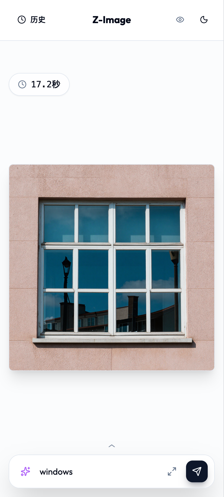
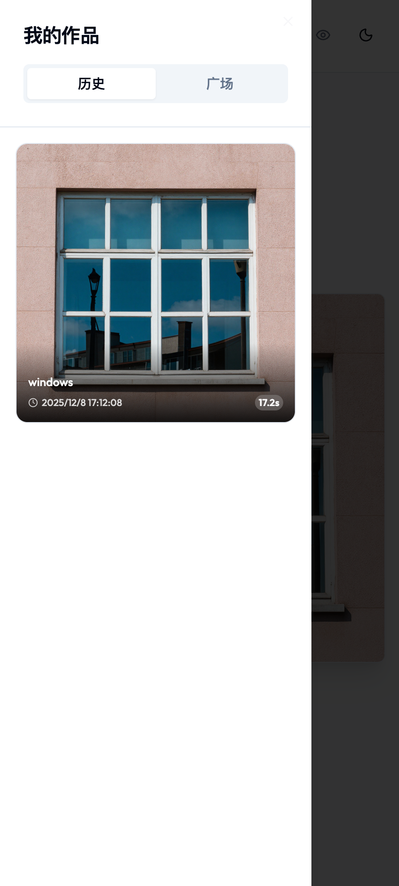

# Z-Image UI

A modern, responsive web interface for ComfyUI image generation workflows, featuring DeepSeek prompt enhancement and a shared gallery.

## Features

*   **Modern UI**: Beautiful, responsive design built with React and TailwindCSS.
*   **Mobile Friendly**: Optimized experience for mobile devices with specific layouts.
*   **Prompt Enhancement**: Integrated DeepSeek API to reason and enhance your prompts for better image results.
*   **History & Gallery**: Local history of your generations and a shared gallery to showcase prompts.
*   **Real-time Progress**: WebSocket integration for real-time generation progress and status updates.
*   **NSFW Mode**: Built-in blurring for sensitive content.

## Screenshots

### Initial Interface

*Clean and simple upload interface*

### Gallery View

*Grid layout showcasing multiple images with titles and actions*

### Image Preview

*Full-screen image viewer with overlay*

### ComfyUI Integration

*Node-based workflow editor for advanced image generation*

## Setup & Run

### Prerequisites
*   Python 3.10+
*   Node.js 18+ (for building frontend)
*   ComfyUI running instance

### Installation

1.  Clone the repository
    ```bash
    git clone https://github.com/FFatTiger/zimage-ui.git
    cd zimage-ui
    ```

2.  Install Backend Dependencies
    ```bash
    # Create virtual environment (optional but recommended)
    python -m venv venv
    source venv/bin/activate  # Windows: venv\Scripts\activate

    # Install requirements
    pip install -r requirements.txt
    ```

3.  配置应用

    **方式一：使用 config.json（推荐）**
    ```bash
    # 复制配置示例
    cp config.example.json config.json
    # 或使用提供的脚本
    python setup_config.py
    ```
    
    然后编辑 `config.json`：
    ```json
    {
      "COMFY_URL": "http://127.0.0.1:8188",
      "WS_URL": "ws://127.0.0.1:8188",
      "DEEPSEEK_API_URL": "https://api.deepseek.com/chat/completions",
      "DEEPSEEK_API_KEY": "your_api_key_here",
      "MODELS": {
        "unet": "z_image_turbo_bf16.safetensors",
        "vae": "ae.safetensors",
        "clip": "qwen_3_4b.safetensors",
        "clip_type": "lumina2"
      },
      "DEFAULT_PARAMS": {
        "steps": 9,
        "cfg": 1.0,
        "sampler_name": "euler",
        "scheduler": "simple",
        "width": 1024,
        "height": 1024,
        "denoise": 1.0,
        "shift": 3
      }
    }
    ```
    
    **方式二：使用环境变量**
    ```bash
    # Create a .env file
    echo "COMFY_URL=http://127.0.0.1:8188" >> .env
    echo "WS_URL=ws://127.0.0.1:8188" >> .env
    echo "DEEPSEEK_API_KEY=your_api_key_here" >> .env
    ```

### 配置说明

#### 基础配置
- `COMFY_URL`: ComfyUI HTTP 服务地址
- `WS_URL`: ComfyUI WebSocket 地址
- `DEEPSEEK_API_KEY`: DeepSeek API 密钥（提示词增强功能）

#### 模型配置（MODELS）
通过配置文件灵活切换模型，无需修改代码：
- `unet`: 主图像生成模型（默认: z_image_turbo_bf16.safetensors）
- `vae`: VAE 编码/解码模型（默认: ae.safetensors）
- `clip`: 文本编码模型（默认: qwen_3_4b.safetensors）
- `clip_type`: CLIP 模型类型（默认: lumina2）

#### 默认参数（DEFAULT_PARAMS）
- `steps`: 采样步数（影响质量与速度）
- `cfg`: CFG Scale 引导强度
- `sampler_name`: 采样器名称
- `scheduler`: 调度器类型
- `width/height`: 图像尺寸
- `denoise`: 去噪强度
- `shift`: ModelSamplingAuraFlow 参数


### Running

**macOS / Linux:**
```bash
chmod +x start.sh
./start.sh
```

**Windows:**
```cmd
start.bat
```

**Manual Start:**
1.  Build Frontend:
    ```bash
    cd frontend
    npm install
    npm run build
    cd ..
    ```
2.  Start Backend:
    ```bash
    uvicorn main:app --host 0.0.0.0 --port 8080
    ```

Access the UI at `http://localhost:8080`.

## Architecture
- **Frontend**: React + Vite + TailwindCSS
- **Backend**: FastAPI
- **Integration**: Proxies requests to ComfyUI backend
